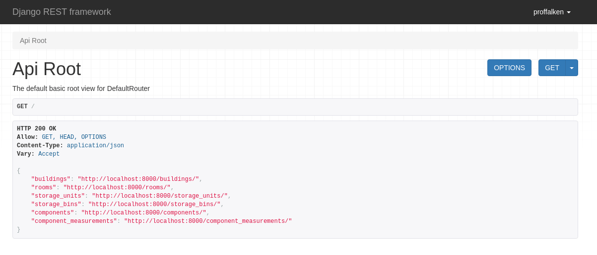
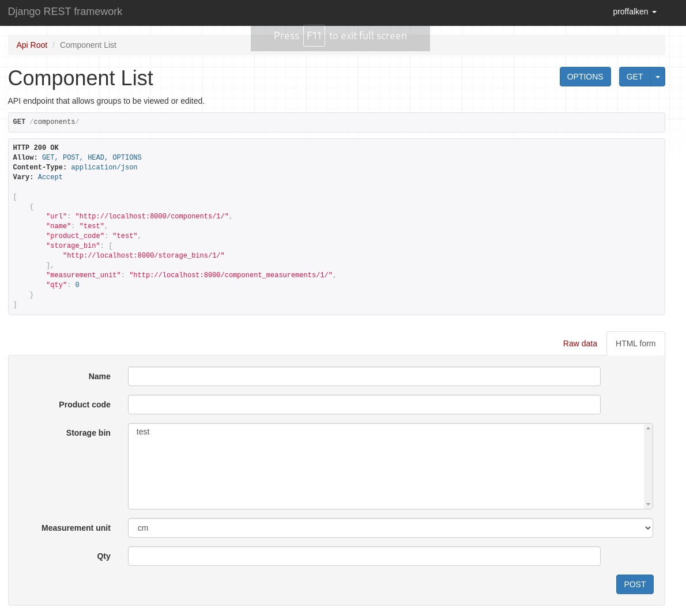
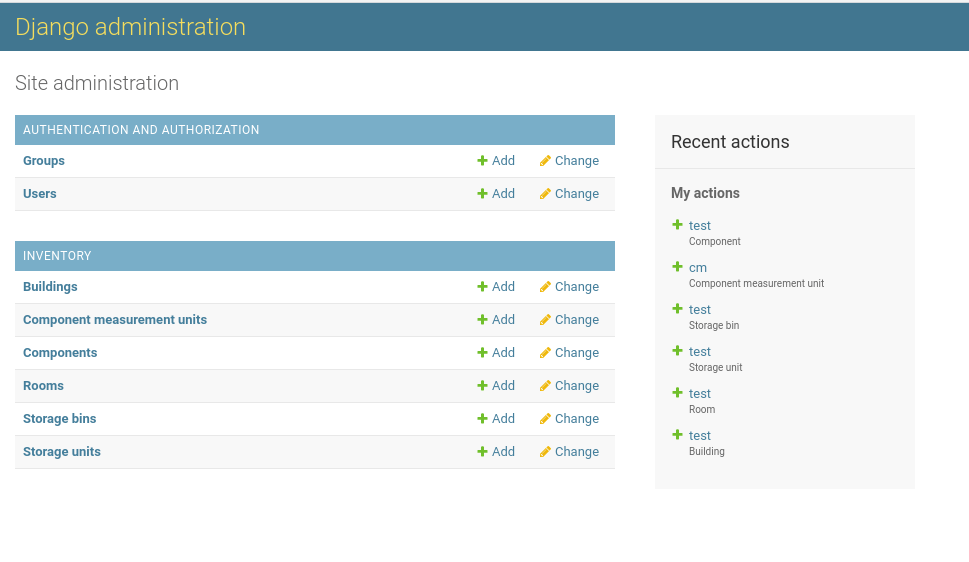
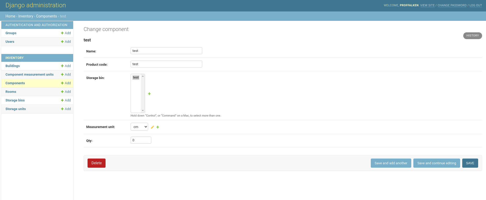

# Mventory

An inventory solution for Makers

## What is it?

Mventory is an API-driven inventory solution for Makers, Makerspaces, Hackspaces, and just about anyone else who needs to keep track of "stuff".

I've written it to scratch an itch because I couldn't find anything else out there that would give me a simple way to keep track of the various components and materials in my garage, and wanted something that could translate easily from my house to a Makerspace in future.

## How does it work?

### What does "API-Driven" mean?

Mventory is "API-driven".  This means that apart from the very basic admin pages there is no "pretty" interface built in, but the ability to communicate with the platform from almost any other platform is there from day one.

Happy with using the built-in admin pages? Great! Go for it!

Want to write an app for your phone that you can use whilst walking around the Makerspace? Yup, you can do that too!

Feel like building your own [ASRS](https://en.wikipedia.org/wiki/Automated_storage_and_retrieval_system) for your workbench? No worries, we've got you covered!

In short by having the built-in admin but allowing anyone to write their own front-end for the platform, all we need to worry about is storing and presenting the raw data to whatever you choose to use to query it.  This makes the code a lot easier to maintain for us, whilst keeping the options for future integration wide open!

### OK, so what can I do with it?

Mventory has the concept of Buildings, Rooms, Storage Units, Bins, and Components (in descending size order).

A component is the smallest unit of measurement and could be anything from a bolt of cloth or a spool of 3D printer filament through to SMD resistors, LED's, or linear actuators.

Components live in "Bins".  A "Bin" is a sub-division of a Storage Unit and could be a box, a drawer, or a specific location on a peg board.

Bins live inside "Storage Units" (chests of drawers, toolboxes, peg boards etc), and Storage Units live inside "Rooms".

Finally, Rooms live inside "Buildings".

This may feel like overkill for a small home setup, but if you're working in a Makerspace that has multiple units on a yard or similar then it could be incredibly useful!

## How do I install it?

This is a standard Django Application, you can get up and running with the following commands after cloning this repo to your machine:

```bash
$ mkvirtualenv mventory
$ pip install -r requirements.txt
$ echo "MVENTORY_SECRET_KEY=$(< /dev/urandom tr -dc _A-Z-a-z-0-9 | head -c${1:-32};echo;)" >> .env
$ source .env
$ ./manage.py migrate
$ ./manage.py createsuperuser # Create your initial user
$ ./manage.py runserver
```

You can then browse to http://localhost:8000/admin and log in to create your buildings, rooms, and other sections/components.

### Database configuration

By default, the platform uses a SQLite3 database stored in the `data` directory.  Once we get to a containerised version, we'll be able to mount this directory outside the container allowing for data persistence during a container upgrade, however for now it's just a simple file.

The database is configured via environment variables.

The simplest way to get up and running with the system is to add the following to the `.env` file created above and then `source` that file:

```bash
export MVENTORY_DB_ENGINE=<database engine>
export MVENTORY_DB_HOST=<database server>
export MVENTORY_DB_USER=<database user name>
export MVENTORY_DB_PASSWORD=<database password>
```
Once you've done this, restart the server using `./manage.py runserver` and you should be connected to your database server instead.

**NOTE:** The `MVENTORY_DB_ENGINE` value should be one of the engines from https://docs.djangoproject.com/en/3.2/ref/settings/#std:setting-DATABASE-ENGINE *without* the `django.db.backends.` part, so `mysql` or `postgresql`.

### Running via Docker

Containers are available for the following architectures:

   * AMD64
   * ARMv6
   * ARMv7
   * ARM64

This should allow you to easily deploy Mventory on all kinds of platforms from enterprise servers to Raspberry Pi-style devices.

The container is [available from the packages page](https://github.com/users/proffalken/packages/container/package/mventory) and you'll want to pass the following environment variables to your container in order to get up and running:

```bash
export MVENTORY_DB_ENGINE=<database engine>
export MVENTORY_DB_HOST=<database server>
export MVENTORY_DB_USER=<database user name>
export MVENTORY_DB_PASSWORD=<database password>
export MVENTORY_SECRET=<some random string>
```

The container exposes the service on port 8000, and once you've got the container up and running you'll need to run the migrations and create the admin user as follows:

```bash
$ docker ps | grep mventory # Get the Container ID from here
$ docker exec -ti <container id from above> /bin/bash
> ./manage.py migrate # Run this inside the container
> ./manage.py createsuperuser # Run this inside the container
```

Once you've done this, you should be able to visit the container in a web browser and log in with your superuser credentials.

## What does it look like?

It's an API, so there isn't really a pretty interface for this (in fact, I'm hoping someone else will write one because it's really not where my skills lie!) however this is what you'll see in a browser if you visit the system once it's up and running:

The API Home Page


One of the API Detail pages (in this case, the one for components)


The Admin home page (available at http://deployment.url/admin)


The Admin page for a component


## How does it work?

MVentory is API-driven, this means that there's no nice UI to look at, but it does "self-document".

If you go to your installation in a browser you'll see a fairly boring set of web-pages that allow you to list the various buildings, rooms, storage units, storage bins, and components and add new ones, but the power of this platform really comes alive when you write your own integration with it.

In the spirit of the Unix philosophy of "do one thing and do it well", all this system does is store information about how many things you have and where they're stored, along with some useful other information such as the unit of measurement for each component.

Front-ends can then be written in *any* language to talk to the API and retrieve that information in JSON format so it can be displayed to the user or integrated as part of a robotic retrieval system.

Here's a few example calls to the API from the command line:

```bash
curl -H 'Accept: application/json; indent=4' -u admin:password123 http://127.0.0.1:8000/components/ # list all components in the system

curl -H 'Accept: application/json; indent=4' -u admin:password123 http://127.0.0.1:8000/rooms/ # list all rooms in the system

curl -H 'Accept: application/json; indent=4' -u admin:password123 http://127.0.0.1:8000/components/?search=555 # return all components with the value "555" in their name or product id
```

More features will be added in future, so keep an eye on the [issue tracker](https://github.com/proffalken/mventory/labels/enhancement) to see what's coming up!

## How do I contribute?

More detail is needed here, but essentially just fork the repo, make your changes on a branch and submit a PR - we look forward to seeing your contributions!
